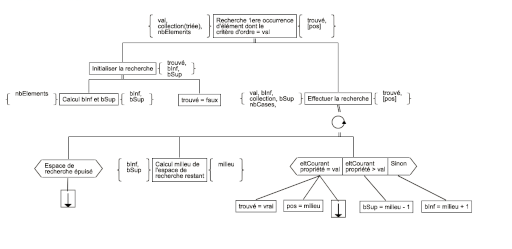

# Just Algo It - Beta

Just Algo It est une application web qui permet de dessiner 
des algorithmes avec le formalisme utilisé en BUT informatique
à l'IUT de Bayonne et du Pays Basque.

/!\ Cette version peut comporter des bugs, elle est en cours
de développement. /!\

Lien vers l'application en ligne : [JustAlgoIt](https://romlabo.github.io/JustAlgoIt/)

Voici en exemple ci-dessous, le dessin de l'algorithme de recherche de première occurrence
réalisé avec l'application.

## Remerciements

Un grand Merci à :
- [Kessentini Nour](https://github.com/nourkessentini)
- [Lavergne Elsa](https://github.com/Yxshad)
- [Dumolié Alexis](https://github.com/AlexisDumolie)
- [Moreno Alex](https://github.com/KyoooCode)
- [Gratchev Grigori](https://github.com/jrijori)
- [Dirchaoui El Mahdi](https://github.com/MahdiSenpai)
- [Crussière Lucas](https://github.com/CRUSSIERE)

Merci à tous les sept pour votre contribution, en réalisant un ensemble de tests
afin de me faire remonter les bugs de l'application.

